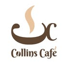

# Collins Café - Sistema de Panel Administrativo (Nubix Market)

Sistema integral de Punto de Venta (POS) y Dashboard Administrativo diseñado para la gestión eficiente de ventas, inventario, reportes y control de accesos. Este proyecto representa la capa frontend interactiva, construida con principios de Clean Architecture (arquitectura limpia).

<p align="center">

</p>

## Objetivos del Proyecto
* Proveer una interfaz de usuario fluida e intuitiva para cajeros y administradores.
* Mantener un control de estado robusto simulando operaciones de base de datos en memoria (LocalStorage).
* Establecer una base escalable y tipada para la futura integración con servicios backend.

## Tecnologías Utilizadas
* **Frontend:** React 19, TypeScript, Vite
* **Enrutamiento:** React Router DOM v7
* **Estilos y UI:** Bootstrap 5, CSS Custom (Variables), Lucide React & Bootstrap Icons
* **Conectividad:** Axios (Cliente HTTP)
* **Persistencia Temporal:** LocalStorage (Simulación / Mock Data)
* **Control de Versiones:** Git & GitHub (GitFlow, Commits Atómicos)


## 📁 Estructura del Proyecto
El código está organizado modularmente para facilitar la mantenibilidad:

```text
src/
├── assets/         # Recursos estáticos e imágenes
├── components/     # Componentes UI reutilizables (Modales, Formularios)
├── data/           # Interfaces TypeScript y datos simulados (Mocks)
├── layouts/        # Estructuras maestras (AdminLayout, Sidebar)
├── pages/          # Vistas principales integradas con el enrutador
└── services/       # Lógica de negocio y operaciones CRUD
```


## Módulos Principales
* **Dashboard:** Vista general con métricas en tiempo real (Ventas del día, pedidos, clientes nuevos y alertas de stock bajo).
* **Punto de Venta:** Interfaz ágil para cajeros, permitiendo registrar órdenes (En local / Para llevar), aplicar descuentos y calcular subtotales.
* **Inventario y Categorías:** Gestión del catálogo de productos (CRUD), control de stock, precios y filtrado dinámico.
* **Reportes:** Visualización de ingresos totales, ticket promedio y listado de transacciones diarias.
* **Usuarios y Roles:** Módulo de seguridad para la gestión del personal, validación estricta de dominios de correo corporativo (@collinscafe.com) y asignación de permisos operativos.


## Instalación y Ejecución 
* **Paso 01:** clonar el Repositorio: "git clone https://github.com/DiegoAntonioCaceresAranda/HDGrupo03-Fronted.git"
* **Paso 02:** Instalar las dependencias: "npm install"
* **Paso 03:** Levantar el servidor local: "npm run dev"


## Credenciales de Prueba
Para acceder al sistema administrativo con privilegios completos:
* **Correo:** admin@collinscafe.com
* **Contraseña:** 123456


